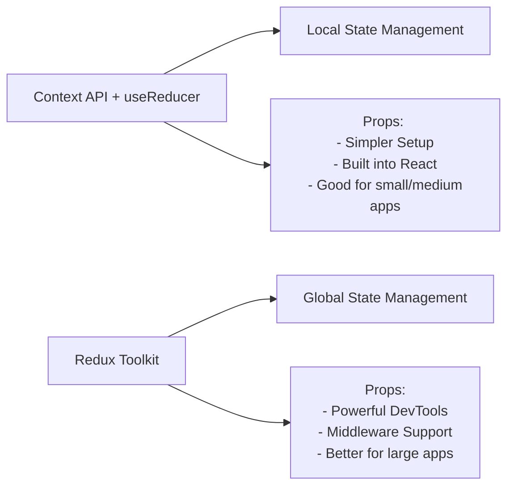
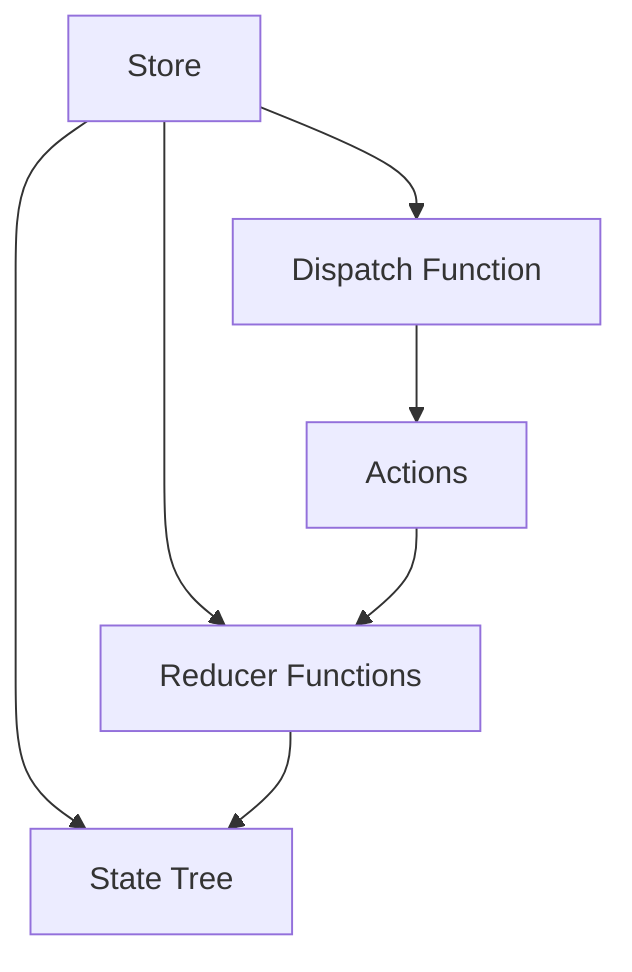
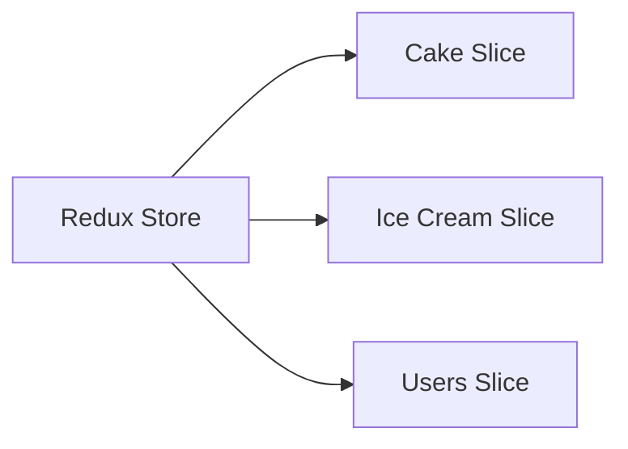
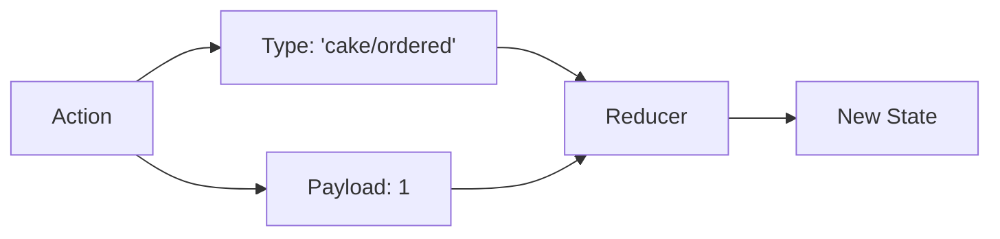
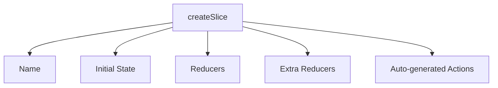
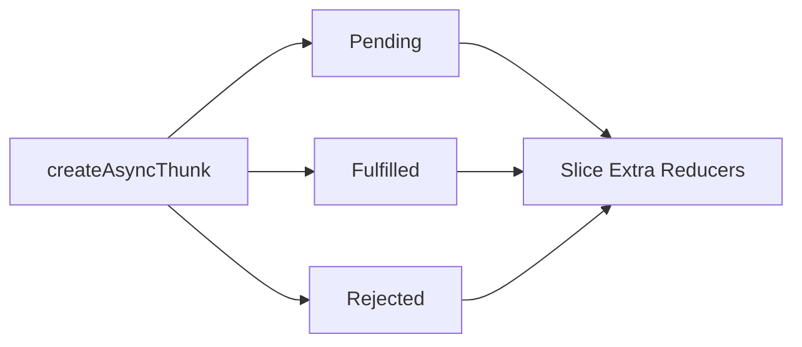

# React Redux Toolkit Documentation

## Table of Contents

- [Overview](#overview)
- [Core Concepts](#core-concepts)
- [Project Structure](#project-structure)
- [From Context API to Redux](#from-context-api-to-redux)
- [Deep Dive into Redux Toolkit](#deep-dive-into-redux-toolkit)
- [Async Operations](#async-operations)

## Overview

Redux Toolkit (RTK) is Redux's official, opinionated, batteries-included toolset for efficient Redux development. It simplifies the Redux setup process and includes utilities to streamline common Redux use cases.

### Context API + useReducer vs Redux Toolkit



## Core Concepts

### Store

Think of the store as a "super context" that:

- Holds the entire application state
- Allows state access via `getState()`
- Allows state updates via `dispatch(action)`



### Slices

Slices are like individual contexts in the Context API. They:

- Contain a portion of the Redux state
- Include reducers for that state
- Auto-generate actions

In this project:



### Actions & Reducers



Context API + useReducer:

```javascript
// Traditional approach
const reducer = (state, action) => {
  switch (action.type) {
    case "ordered":
      return { ...state, count: state.count - action.payload };
    default:
      return state;
  }
};
```

Redux Toolkit:

```javascript
// RTK approach (from our cakeSlice.js)
const cakeSlice = createSlice({
  name: "cake",
  initialState,
  reducers: {
    ordered(state, action) {
      state.cakeCount -= action.payload;
    },
  },
});
```

## Project Structure

```
src/
├── app/
│   └── store.js           # Global store configuration
├── features/
│   ├── cake/
│   │   ├── Cake.jsx      # Component
│   │   └── cakeSlice.js  # State logic
│   ├── iceCream/
│   │   ├── IceCream.jsx
│   │   └── iceCreamSlice.js
│   └── users/
│       ├── Users.jsx
│       └── usersSlice.js
```

This structure follows the "feature folder" pattern where each feature contains:

- React Component (.jsx)
- State Management Logic (.js)

## Deep Dive into Redux Toolkit

### Store Setup

```javascript
// store.js
import { configureStore } from "@reduxjs/toolkit";

const store = configureStore({
  reducer: {
    cake: cakeReducer,
    iceCream: iceCreamReducer,
    users: usersReducer,
  },
});
```

### Slice Pattern



Example from this project:

```javascript
// cakeSlice.js
const cakeSlice = createSlice({
  name: "cake",
  initialState: { cakeCount: 10 },
  reducers: {
    ordered: (state, action) => {
      state.cakeCount -= action.payload;
    },
  },
});
```

### Component Integration

```javascript
// Cake.jsx
function Cake() {
  const cakeCount = useSelector((state) => state.cake.cakeCount);
  const dispatch = useDispatch();

  return <button onClick={() => dispatch(ordered(1))}>Order cake</button>;
}
```

## Async Operations

Redux Toolkit provides `createAsyncThunk` for handling async operations:



From this project (usersSlice.js):

```javascript
const fetchUsers = createAsyncThunk('users/fetchUsers',
  async () => {
    const response = await axios.get('https://jsonplaceholder.typicode.com/users')
    return response.data
  }
)

// Handle async states in slice
extraReducers(builder) {
  builder
    .addCase(fetchUsers.pending, (state) => {
      state.isLoading = true
    })
    .addCase(fetchUsers.fulfilled, (state, action) => {
      state.users = action.payload
    })
}
```

### Key Differences from Context + useReducer

1. **State Updates**:

   - Context + useReducer: Must return new state object
   - RTK: Can "mutate" state directly (uses Immer under the hood)

2. **Action Creation**:

   - Context + useReducer: Manual action object creation
   - RTK: Actions auto-generated by createSlice

3. **Async Handling**:

   - Context + useReducer: Need custom solutions
   - RTK: Built-in async utilities with createAsyncThunk

4. **Middleware**:
   - Context + useReducer: No built-in middleware
   - RTK: Rich middleware ecosystem

## Real-world example from this project

The Ice Cream feature demonstrates advanced RTK concepts:

1. **State Dependencies**: Ice cream slice listens to cake orders

```javascript
// iceCreamSlice.js
extraReducers(builder) {
  builder.addCase(cakeOrdered, (state, action) => {
    state.iceCreamCount -= action.payload
  })
}
```

2. **Component State + Redux**: Combines local state (useState for input) with Redux state

```javascript
// IceCream.jsx
const [restockAmt, setRestockAmt] = useState(1);
const iceCreamCount = useSelector((state) => state.iceCream.iceCreamCount);
```

3. **Async Data Fetching**: Users feature shows RTK's async capabilities

```javascript
// Users.jsx
useEffect(() => {
  dispatch(fetchUsers());
}, []);
```

Remember: Choose Redux when you need:

- Complex state logic
- Frequent state updates
- Large-scale application
- Team collaboration
- State debugging capabilities

For simpler applications, Context API + useReducer might be sufficient.
